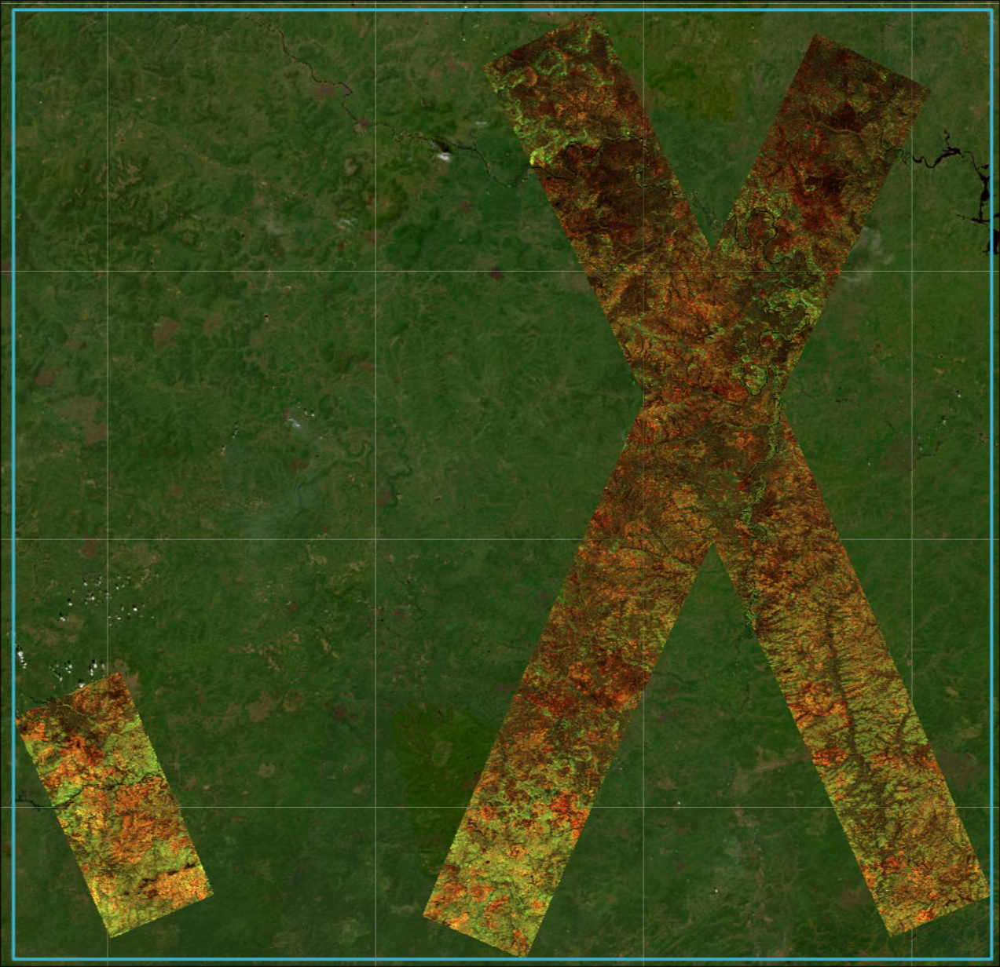

# ESA BIOMASS Gamma0 MGRS DPS



Create fixed-grid 25 m MGRS Beta0 and linear Gamma0 products from an ESA
BIOMASS Level-1B granule, using staged files or a MAAP Item-ID fetch job.

## About

This MAAP DPS algorithm converts the four-polarization Beta0 amplitudes in one
ESA BIOMASS L1B product into analysis-ready products on every overlapping
standard 100 km MGRS tile in a UTM zone intersecting the source bbox. For each
tile, it:

1. Reads the staged source STAC Item, Beta0 TIFF, radiometry LUT, and annotation XML.
2. Samples the GammaNought LUT in radar geometry and calculates linear Gamma0
   as `Beta0² × GammaNought`.
3. Warps four Beta0 polarizations, four Gamma0 polarizations, and GammaNought
   directly onto an exact 4,000 x 4,000 pixel, 25 m UTM tile grid.
4. Writes nine Cloud Optimized GeoTIFFs, a display-only RGB thumbnail, and STAC
   metadata.

Two registered MAAP algorithms expose the same scientific product:

| Algorithm | Use it when | Inputs |
| --- | --- | --- |
| `esa_biomass_gamma0_staged` | You already have the source Item JSON, Beta0 TIFF, radiometry LUT, and annotation XML as MAAP-accessible files. | Four `File` values |
| `esa_biomass_gamma0_fetch` | You have a BIOMASS L1B STAC Item ID and want the job to retrieve its source files. | One `item_id` string |

Choose **staged** when another workflow has prepared the four files. Its CWL
permits MAAP File staging over the network, but the staged workflow accepts only
local paths and retrieves no credentials. Choose **fetch** when submitting an
Item ID is more convenient. Fetch retrieves MAAP-managed secrets inside the job,
creates temporary local files, and runs the same staged processing workflow.

## Search STAC and submit MAAP jobs

`maap-py` 5.1 and later submit OGC Application Package jobs with
`submit_job(process_id, inputs, queue)`. A deployed process selects its release;
do not pass an algorithm version to the call. This example searches the BIOMASS
STAC catalog and starts one fetch job for each matched Item. Set `max_items`
to a small value before submitting a large batch.

```python
from maap.maap import MAAP
from pystac_client import Client

maap = MAAP()

QUEUE = "maap-dps-worker-16gb"
TAG = "mosaic-test"
ALGORITHM_NAME = "esa_biomass_gamma0_fetch"
ALGORITHM_VERSION = "0.1.3"

response = maap.list_algorithms()
response.raise_for_status()

process_id = None
for process in response.json()["processes"]:
    if process["id"] == ALGORITHM_NAME and process["version"] == ALGORITHM_VERSION:
        process_id = process["processID"]
        print(f"found process id {process_id}")
        break

if not process_id:
    raise ValueError(
        f"could not find a process matching {ALGORITHM_NAME} {ALGORITHM_VERSION}"
    )


search = Client.open("https://catalog.maap.eo.esa.int/catalogue/").search(
    collections=["BiomassLevel1b"],
    bbox=[102, 60, 112, 63],
    datetime="2026-06-01/2026-06-30",
)

items = search.items()

for item in items:
    response = maap.submit_job(
        process_id=process_id,
        inputs={"item_id": item.id},
        queue=QUEUE,
        tag=TAG,
    )
    response.raise_for_status()
```

The response is a `requests.Response`; the `Location` header identifies the
asynchronous job. Get its ID from the final URL path and monitor it with
`maap.get_job_status(job_id)`, or use the MAAP Jobs UI.

Inside each fetch job, `MAAP().secrets.get_secret` retrieves
`ESA_MAAP_CLIENT_SECRET` and `ESA_OFFLINE_TOKEN` from MAAP secrets. Configure
those secrets in MAAP before submitting a job; never include credentials in
`inputs`. Both algorithms return the same `./output` Directory.

### Staged files

Submit `esa_biomass_gamma0_staged` when the four source files are available as
MAAP-accessible URLs. OGC `File` inputs use an `href` object:

```python
from maap.maap import MAAP

response = MAAP().submit_job(
    process_id="esa_biomass_gamma0_staged",
    inputs={
        "source_item": {"href": "s3://<bucket>/source-item.json"},
        "beta0_tiff": {"href": "s3://<bucket>/enclosure.tif"},
        "radiometry_lut": {"href": "s3://<bucket>/enclosure.nc"},
        "annotation_xml": {"href": "s3://<bucket>/annotation.xml"},
    },
    queue="<MAAP queue with at least 16 GB>",
    tag="biomass-gamma0-staged-example",
)
response.raise_for_status()
print(response.headers["Location"])
```

Use a queue available to your MAAP organization that meets the algorithm's
resource request: staged requires 16 GB and eight cores; fetch requires 16 GB
and four cores. The tracked CWLs in `dps/staged/` and `dps/fetch/` define the
registered interfaces; [DEVELOPMENT.md](DEVELOPMENT.md) describes the
release-managed deployment path.

### Local CLI

For local development, provide the same four inputs as local files. The CLI
creates the output directory and does not download source assets:

```bash
uv sync --frozen
uv run --frozen --no-dev process-gamma0 staged \
  --source-item path/to/source-item.json \
  --beta0-tiff path/to/enclosure.tif \
  --radiometry-lut path/to/enclosure.nc \
  --annotation-xml path/to/annotation.xml \
  --output-root ./output
```

Each run replaces complete existing tile products.

### Local Item-ID runs

The unified CLI also provides `process-gamma0 fetch <item-id>` for MAAP
runtimes with the `fetch` extra and MAAP-managed secrets. Its `local` command is
a development-only adapter: it searches MAAP, downloads an Item's three source
assets into `/tmp/esa-biomass-gamma0/`, writes a sanitized source Item there,
and delegates to the staged workflow. A complete cache is reusable offline; use
`--refresh` to stage the Item and assets again.

First, query the MAAP STAC API for candidate IDs in an AOI. Replace the example
WGS84 bbox with your AOI:

```bash
uv run python - <<'PY' > /tmp/item-ids.txt
import logging
from pystac_client import Client

logger = logging.getLogger("esa-biomass-gamma0")

search = Client.open("https://catalog.maap.eo.esa.int/catalogue/").search(
    collections=["BiomassLevel1b"],
    bbox=[108.15,62.22,108.44,62.31],
    max_items=5,
    sortby="-datetime",
)

items = list(search.items())
logger.info(f"found {len(items)} items")

for item in search.items():
    print(item.id)
PY
```

Set local MAAP credentials, then process the discovered IDs sequentially into
the shared `./output/` Catalog:

```bash
export ESA_MAAP_CLIENT_SECRET=...
export ESA_OFFLINE_TOKEN=...

while IFS= read -r item_id; do
  uv run --extra fetch process-gamma0 local "$item_id"
done < /tmp/item-ids.txt
```

For one Item, run `uv run --extra fetch process-gamma0 local <item-id>`. Pass
`--output-root <directory>` to use a different output root, `--cache-dir
<directory>` to change the persistent cache, or `--refresh` to refresh its
staged source files. Processing always replaces existing products.

```bash
ITEM_ID=BIO_S2_DGM__1S_20260601T121355_20260601T121415_T_G01_M03_C07_T008_F100_02_DSD6MY
uv run process-gamma0 local --output-root /tmp/${ITEM_ID} ${ITEM_ID}
```

To download only an Item's Beta0 TIFF for local inspection, use the same local
credentials with `scripts/download_beta0.py`:

```bash
uv run --extra fetch python scripts/download_beta0.py "$ITEM_ID"
```

It writes `/tmp/<source filename>` by default; use `--output <path>` to change it.

### Browse a local output root with eoAPI

Each run rebuilds the root `catalog.json` with direct links to every valid nested
Item in its output root. The local Compose stack runs PgSTAC, STAC API, TiTiler,
TiPG, and STAC Browser on the usual eoAPI ports. It mounts `./output`
read-only into TiTiler at
`/data/gamma0`. TiPG exposes the loaded PgSTAC Items as the
`pgstac.items` feature collection.

```bash
docker compose up --build -d

export PGHOST=127.0.0.1
export PGPORT=5439
export PGDATABASE=postgis
export PGUSER=username
export PGPASSWORD=password

uv run --with 'pypgstac[psycopg]==0.9.11' python scripts/load_pgstac.py ./output \
  --asset-root /data/gamma0
```

Open the STAC API at <http://localhost:8081>, TiTiler at
<http://localhost:8082>, TiPG at <http://localhost:8083/collections/pgstac.items>,
and STAC Browser at <http://localhost:8085>. The loader creates a temporary
PgSTAC Collection and upserts the Catalog's registered Items, so rerun it after
adding local products.

Set `GAMMA0_OUTPUT_ROOT=/absolute/path/to/output` before `docker compose up` to
mount a different output root. The loader maps its relative COG and thumbnail
HREFs to `file:///data/gamma0/...` only in the database copy; generated STAC
files remain portable. `pypgstac` is fetched only for this command and is not
part of the DPS runtime; its version matches the bundled PgSTAC database.

## DPS inputs

`esa_biomass_gamma0_staged` accepts `source_item`, `beta0_tiff`,
`radiometry_lut`, and `annotation_xml` as MAAP `File` values. The Item must
reference `enclosure_tiff`, `enclosure_nc`, and `enclosure_annot_xml` assets.

`esa_biomass_gamma0_fetch` accepts only `item_id`, a BIOMASS L1B STAC Item ID.
It never accepts staged files, secret values, or a cache path.

DPS jobs always produce fixed 25 m products and replace existing products.

## Release deployment

CI runs pre-commit hooks, a strict documentation build, CWL validation, tests,
and container smoke tests on pull requests. Merges to `main` deploy the
MkDocs site to GitHub Pages after its checks pass.

Release Please turns conventional commits merged to `main` into a reviewed
release PR. Merging that PR creates the GitHub Release, publishes immutable
version-tagged staged and fetch images, and registers or updates both MAAP
processes. `latest` images from `main` are development-only and never appear in
tracked CWLs or MAAP deployment. See [DEVELOPMENT.md](DEVELOPMENT.md) for the
required `RELEASE_PLEASE_TOKEN`, `MAAP_TOKEN`, GHCR visibility, and recovery
procedure.

## Output

Each accepted source granule and MGRS tile produces:

```text
<tile>/<acquisition-date>/<source-item-id>/
  <source-item-id>-<tile>-beta0_hh.tif
  <source-item-id>-<tile>-beta0_hv.tif
  <source-item-id>-<tile>-beta0_vh.tif
  <source-item-id>-<tile>-beta0_vv.tif
  <source-item-id>-<tile>-gamma0_hh.tif
  <source-item-id>-<tile>-gamma0_hv.tif
  <source-item-id>-<tile>-gamma0_vh.tif
  <source-item-id>-<tile>-gamma0_vv.tif
  <source-item-id>-<tile>-gamma0_lut.tif
  <source-item-id>-<tile>-thumbnail.png
  item.json
```

The job also writes `catalog.json` at the output root, with direct links to each
Item. Asset filenames include their source Item ID and MGRS tile so they remain
unique across the job output. Scientific COGs are single-band `float32` rasters with `-9999.0` nodata;
Gamma0 is linear intensity, not dB. Every Item provides descriptive
polarization-specific titles, media types, and roles for all ten assets.

### Sample STAC metadata

[`examples/stac/`](examples/stac/) contains a portable Collection and one
representative Item. It is metadata-only: the referenced raster and thumbnail
assets are intentionally not checked in. Regenerate it after STAC changes with:

```bash
uv run python scripts/generate_stac_example.py
```

For implementation details and validation requirements, see
[`dev-docs/specs/gamma0-mgrs-utm-stac-workflow.md`](dev-docs/specs/gamma0-mgrs-utm-stac-workflow.md).
